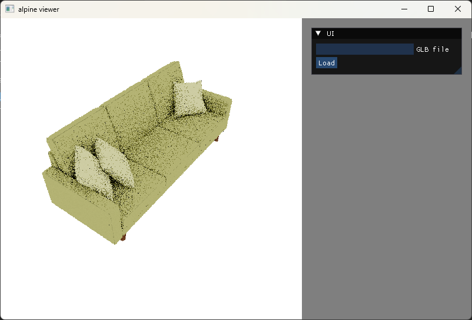
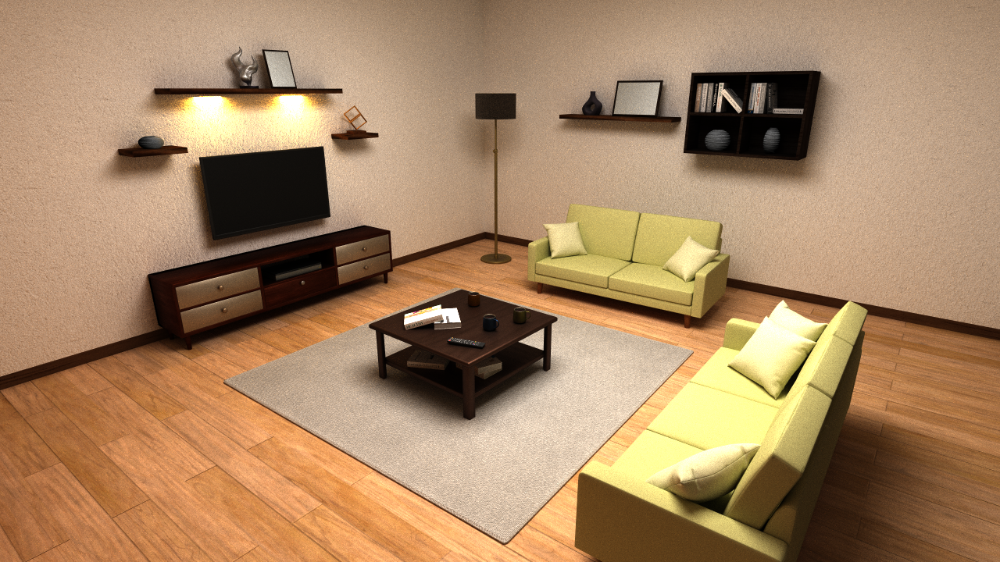
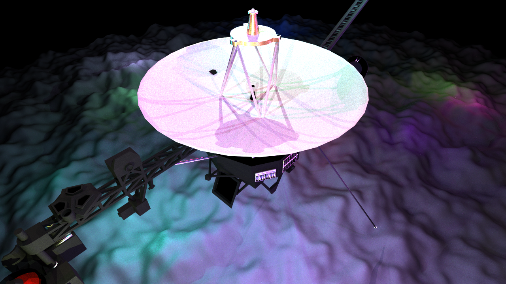

# alpine
**apline** is a CPU path tracer, and is developed to experiment several rendering algorithms.

## Requirements
- Visual Studio 2022
- C++ 20
- CMake 3.26
- OpenGL 4.6 (optional for [viewer](#viewer))

## Build
1. (Optional) Download the following libraries, and put them into the `ext` directory
    - [GLFW](https://www.glfw.org/) 3.4  
    It is required to build [viewer](#viewer)  
    - [Intel Embree](https://www.embree.org/) 4.3.3  
    It can be used as an accelerator.
    - [Intel Open Image Denoise](https://www.openimagedenoise.org/) 2.3.0  
    It can be used as a denoiser.

2. Fetch git submodules
    ```
    git submodule update --init
    ```

3. Run CMake in the root directory
    ```
    cmake -S . -B build
    ```
    CMake Options:  
    `ALPINE_BUILD_APPS`: Enables build of [sample applications](#sample-applications). This option is OFF by default.  
    `ALPINE_ENABLE_EMBREE`: Enables Intel Embree. This option is OFF by default.  
    `ALPINE_ENABLE_OIDN`: Enables Intel Open Image Denoise. This option is OFF by default.

4. Open the solution file `alpine.sln` generated in the `build` directory, and build it in Visual Studio

## Sample Applications
### simple
*simple* is an application which generates an image using path tracing. It takes either an obj file or a glb file as input, and outputs a ppm file.

Options:  
`-i, --input`: Input file (.obj|.glb)  
`-o, --output`: Output image file (.ppm)  
`--spp`: Number of samples per pixel  
`--accelerator`: Accelerator type: "bvh" or "embree"  
`--lightSampler`: Light sampler type: "uniform", "power", or "bvh"  
`--denoiser`: Enable denoiser  

Example:  
```
simple -i input.glb -o output.ppm --spp 64 --accelerator bvh --lightSamplerType bvh --denoiser
```

### viewer
*viewer* is a progressive path tracer, and takes a glb file as input.
```
viewer input.glb
```
  

The camera can be manipulated by a mouse.  
`Left Drag`: Rotate  
`Middle Drag`: Pan  
`Middle Wheel`: Zoom  

## Images
  
  
