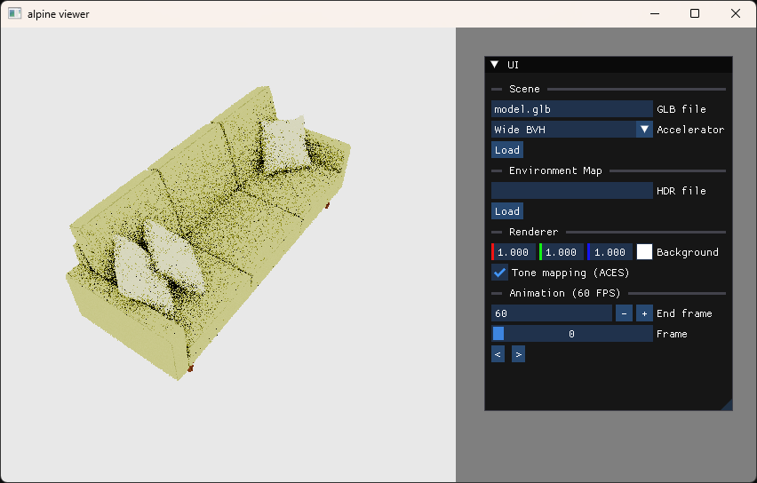
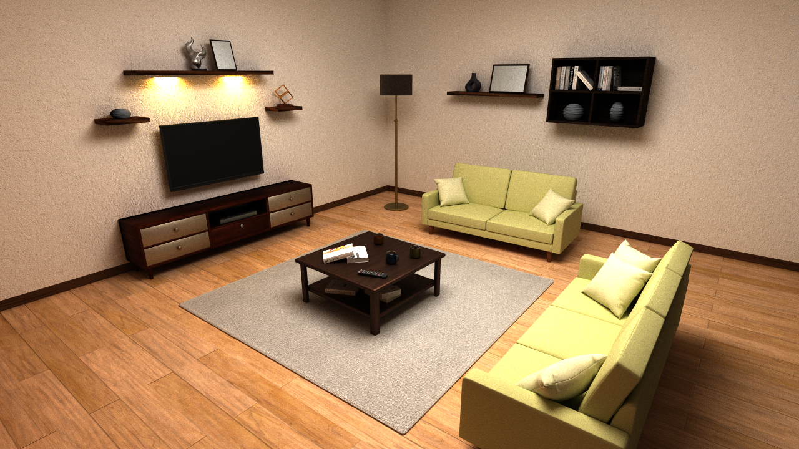
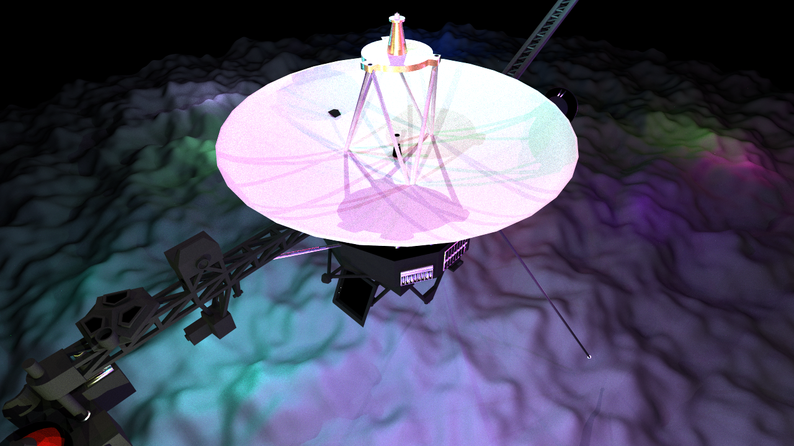
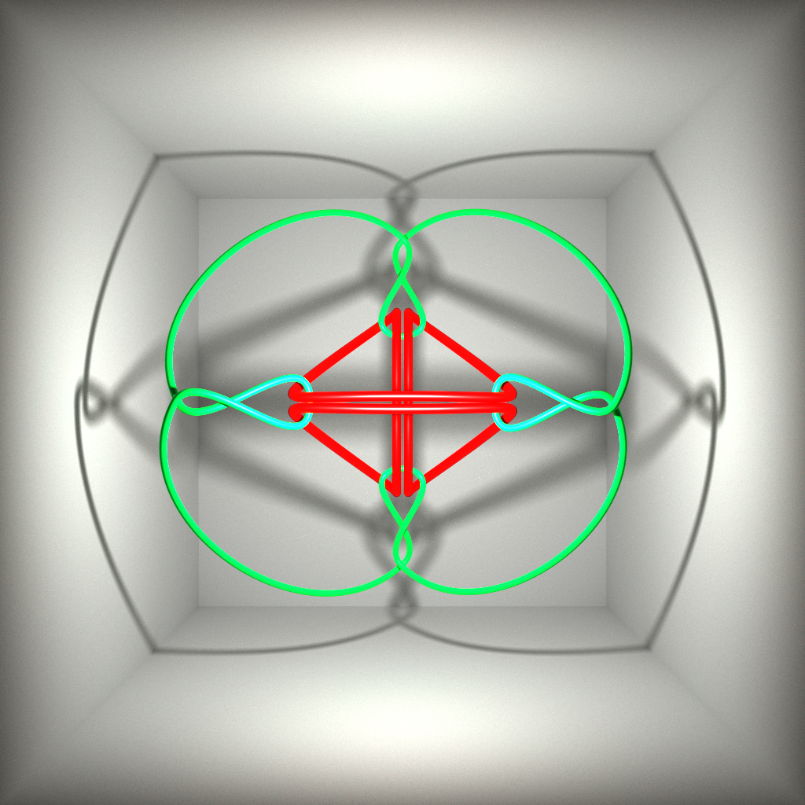

# alpine
**alpine** is a CPU path tracer developed for experimenting with various rendering algorithms.

## Features
- Sampling
  - Multiple importance sampling (BSDF sampling + light sampling)
  - Microfacet BSDF sampling using the distribution of visible normals (VNDF)
  - Many-light sampling using a light BVH
- Acceleration structures
  - Wide BVH with SIMD (implemented in ISPC)
  - Selectable acceleration structure: Built-in (Binary BVH / Wide BVH) or Embree
  - Animation support with BVH reconstruction

## Supported Platforms
- Windows
- macOS

## Requirements
- C++ 20
- CMake 3.15 or later
- OpenGL (optional; required for [viewer](#viewer))

### Windows
- Visual Studio 2022

## Build Instructions
1. Fetch git submodules
    ```bash
    git submodule update --init
    ```

2. Configure and build using CMake in the root directory
    ### Windows
    ```bash
    cmake -S . -B build
    ```
    Then open `build/alpine.sln` in Visual Studio and build the solution.

    ### macOS
    ```bash
    cmake -S . -B build
    cmake --build build -j
    ```
    **Note:** The default build type is `Release`.  
    To build in `Debug`, add `-DCMAKE_BUILD_TYPE=Debug`.
    ```bash
    cmake -S . -B build -DCMAKE_BUILD_TYPE=Debug
    cmake --build build -j
    ```

3. Optionally enable the features via the following CMake options (Windows / macOS)  
    For each option, make sure to manually download the required library and place it in the specified directory under `ext/`:  

    | CMake Option | Description | Required Library | Place in |
    | - | - | - | - |
    | `ALPINE_BUILD_APPS`    | Builds alpine [sample applications](#sample-applications). | [GLFW](https://www.glfw.org/) 3.4 (for [viewer](#viewer)) | `ext/glfw` |
    | `ALPINE_ENABLE_EMBREE` | Enables Embree as an accelerator option. | [Intel Embree](https://www.embree.org/) 4.3.3             | `ext/embree` |
    | `ALPINE_ENABLE_OIDN`   | Enables a denoising option via OIDN. | [Intel Open Image Denoise](https://www.openimagedenoise.org/) 2.3.0 | `ext/oidn`   |
    | `ALPINE_ENABLE_ISPC`   | Enables ISPC-based SIMD code generation. This enables Wide BVH as an accelerator option. | [Intel ISPC](https://ispc.github.io/) 1.26.0              | `ext/ispc`   |

## Sample Applications
### simple
*simple* is an application which generates an image using path tracing. It takes either an obj file or a glb file as input, and outputs a ppm file.

Options:  
`-i, --input`: Input file (.obj|.glb)  
`-o, --output`: Output image file (.ppm)  
`--spp`: Number of samples per pixel  
`--accelerator`: Accelerator type: "bvh", "wideBvh" or "embree"  
`--lightSampler`: Light sampler type: "uniform", "power", or "bvh"  
`--denoiser`: Enable denoiser  

Example:  
```bash
simple -i input.glb -o output.ppm --spp 64 --accelerator bvh --lightSampler bvh --denoiser
```

### viewer
*viewer* is a progressive path tracer, and takes a glb file as input.
```bash
viewer input.glb
```
  

The camera can be manipulated by a mouse.  
`Left Drag`: Rotate  
`Middle Drag`: Pan  
`Middle Wheel`: Zoom  

## Images
<p align="center">
  
  
</p>
<p align="center">
  
</p>
